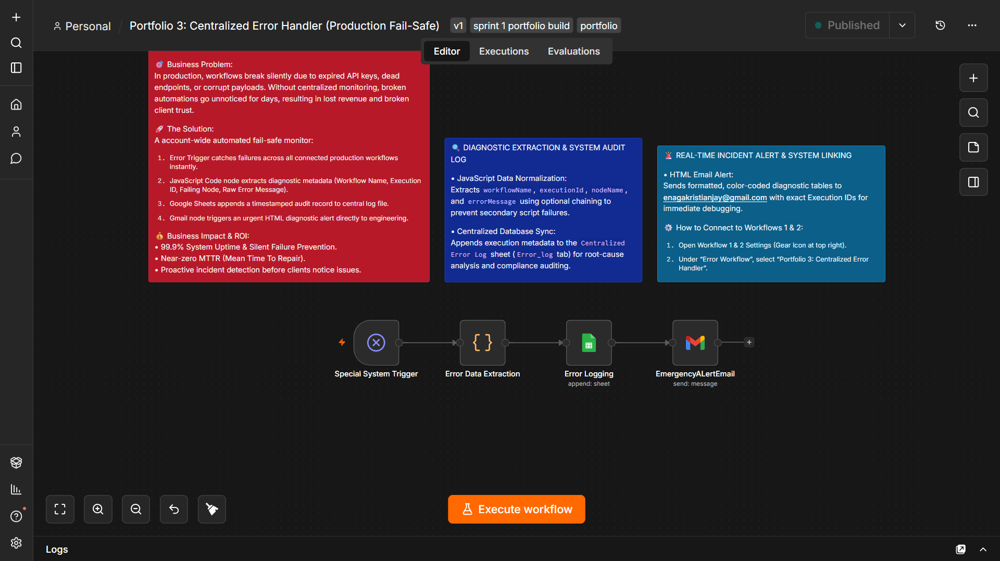
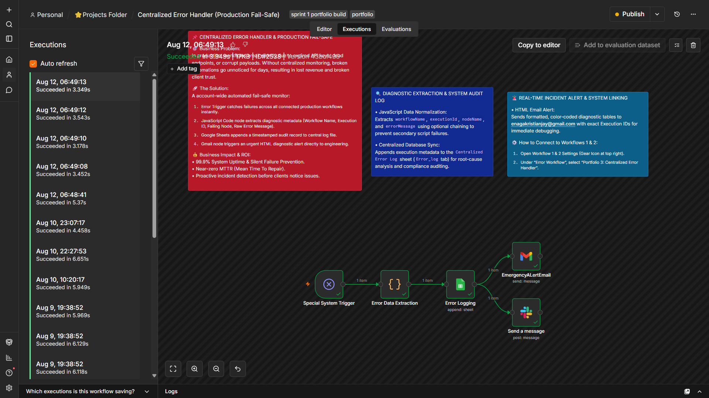
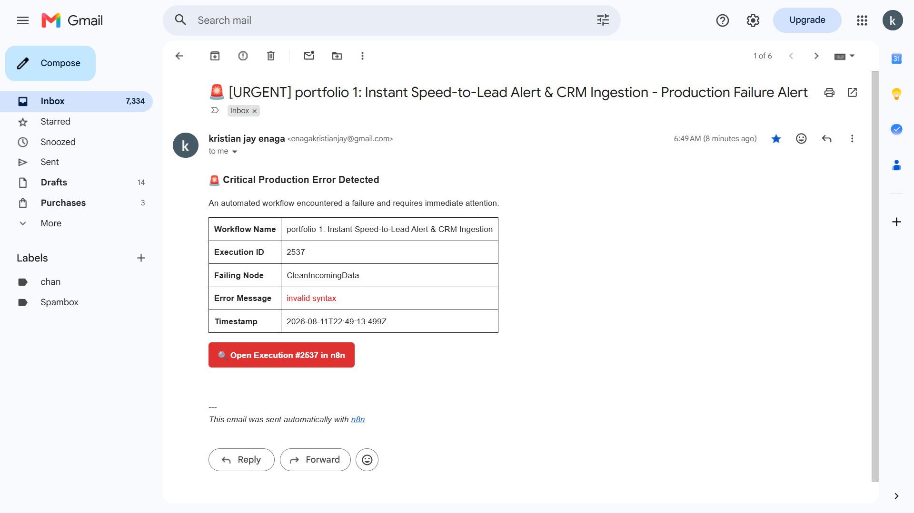
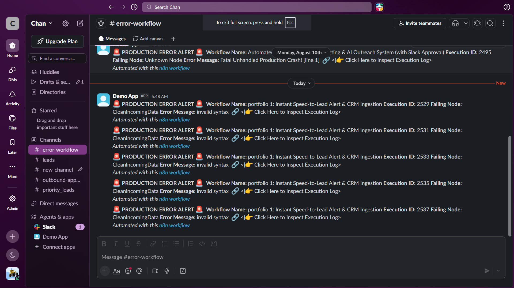

# 📌Centralized Error Handler (Production Fail-Safe)

## 📹 Video Demo
Watch the 3-minute Loom walkthrough: [Centralized Error Handler Video Demo](https://www.loom.com/share/ea1602f3bd8a4086983c96590e49136f)

---

## 🎯 Business Problem
In production, automations break silently due to expired API keys, dead endpoints, or corrupt payloads. Without centralized monitoring, failures go unnoticed for days, leading to lost revenue and damaged client trust.

## 🚀 Solution Architecture
An account-wide automated fail-safe monitor built in n8n:
1. **Error Trigger**: Automatically captures failures across all connected production workflows.
2. **JS Extraction**: Normalizes diagnostic metadata (`workflowName`, `executionId`, `nodeName`, `errorMessage`).
3. **Google Sheets Audit Log**: Appends a timestamped audit record for compliance and debugging.
4. **Gmail Incident Alert**: Sends formatted HTML diagnostic alerts directly to the engineering team.

## 💰 Business Impact
* **99.9% Uptime**: Eliminates silent failures.
* **Near-Zero MTTR**: Instant notifications with exact execution IDs for rapid debugging.
* **Maintainability**: Centralized error management instead of duplicating error paths in every workflow.

## 🧪 Multi-Channel Incident Alert & Execution Proof

Here is the live verification of automated incident notifications dispatched across Email and Slack upon production failure, accompanied by execution history logs.

### 1. n8n Central Error Handler Execution History

*Figure 1: n8n execution log capturing cross-workflow failure events in real-time.*

### 2. Gmail HTML Incident Alert

*Figure 2: Formatted HTML email delivered with diagnostic metadata and 1-click execution link for fast debugging.*

### 3. Slack Real-Time Engineering Alert

*Figure 3: Instant Slack webhook notification sent directly to the engineering channel for immediate triage.*
